## Descriptive Summary Statistics:
|       |      age |        sex |         cp |   trtbps |     chol |        fbs |    restecg |   thalachh |       exng |   oldpeak |        slp |        caa |      thall |     output |
|:------|---------:|-----------:|-----------:|---------:|---------:|-----------:|-----------:|-----------:|-----------:|----------:|-----------:|-----------:|-----------:|-----------:|
| count | 303      | 303        | 303        | 303      | 303      | 303        | 303        |   303      | 303        | 303       | 303        | 303        | 303        | 303        |
| mean  |  54.3663 |   0.683168 |   0.966997 | 131.624  | 246.264  |   0.148515 |   0.528053 |   149.647  |   0.326733 |   1.0396  |   1.39934  |   0.729373 |   2.31353  |   0.544554 |
| std   |   9.0821 |   0.466011 |   1.03205  |  17.5381 |  51.8308 |   0.356198 |   0.52586  |    22.9052 |   0.469794 |   1.16108 |   0.616226 |   1.02261  |   0.612277 |   0.498835 |
| min   |  29      |   0        |   0        |  94      | 126      |   0        |   0        |    71      |   0        |   0       |   0        |   0        |   0        |   0        |
| 25%   |  47.5    |   0        |   0        | 120      | 211      |   0        |   0        |   133.5    |   0        |   0       |   1        |   0        |   2        |   0        |
| 50%   |  55      |   1        |   1        | 130      | 240      |   0        |   1        |   153      |   0        |   0.8     |   1        |   0        |   2        |   1        |
| 75%   |  61      |   1        |   2        | 140      | 274.5    |   0        |   1        |   166      |   1        |   1.6     |   2        |   1        |   3        |   1        |
| max   |  77      |   1        |   3        | 200      | 564      |   1        |   2        |   202      |   1        |   6.2     |   2        |   4        |   3        |   1        |

## Median Statistics:
|          |     0 |
|:---------|------:|
| age      |  55   |
| sex      |   1   |
| cp       |   1   |
| trtbps   | 130   |
| chol     | 240   |
| fbs      |   0   |
| restecg  |   1   |
| thalachh | 153   |
| exng     |   0   |
| oldpeak  |   0.8 |
| slp      |   1   |
| caa      |   0   |
| thall    |   2   |
| output   |   1   |

## Histograms and Scatter Plot: 
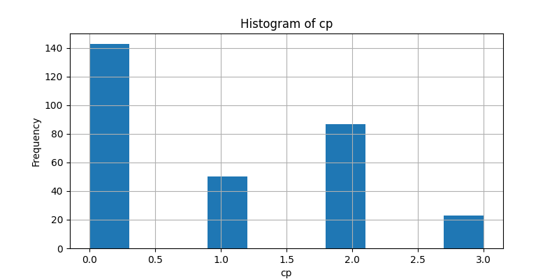

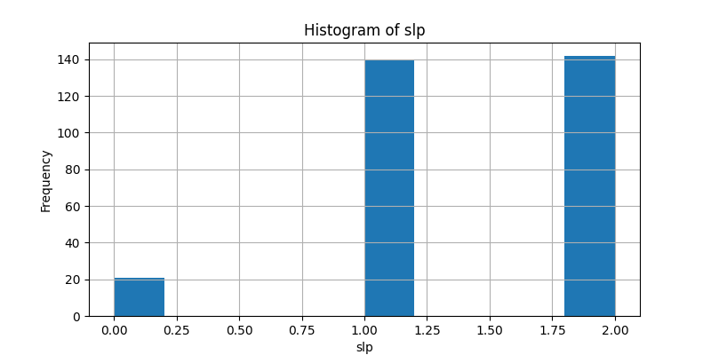

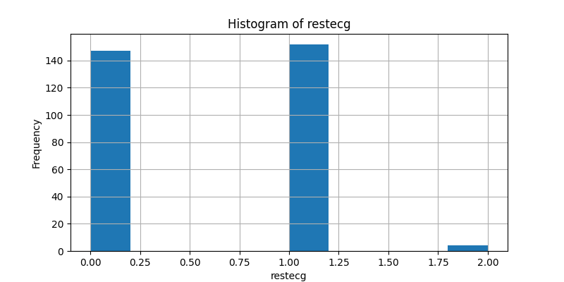

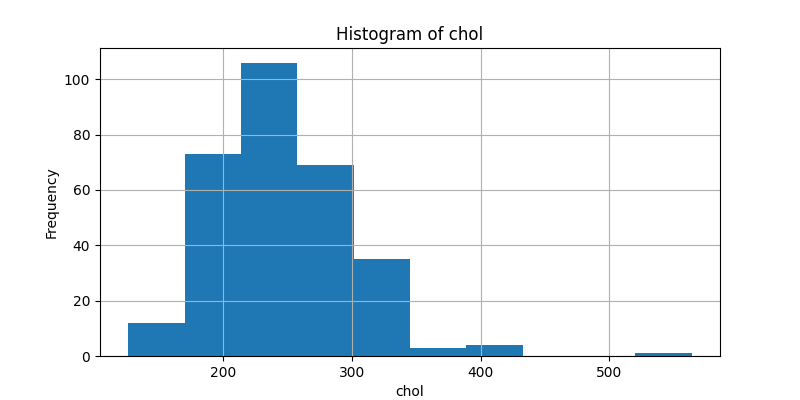

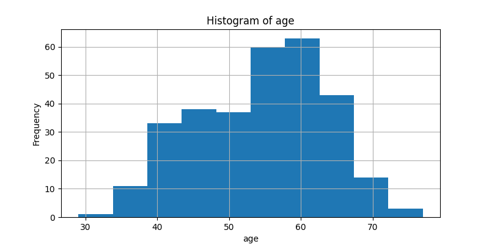

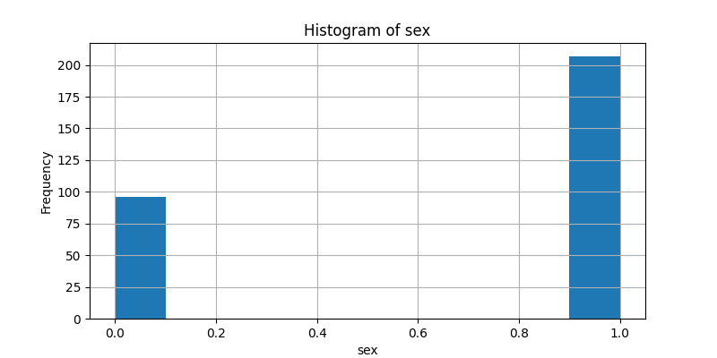

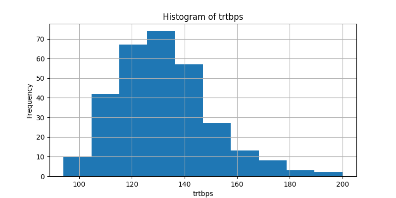

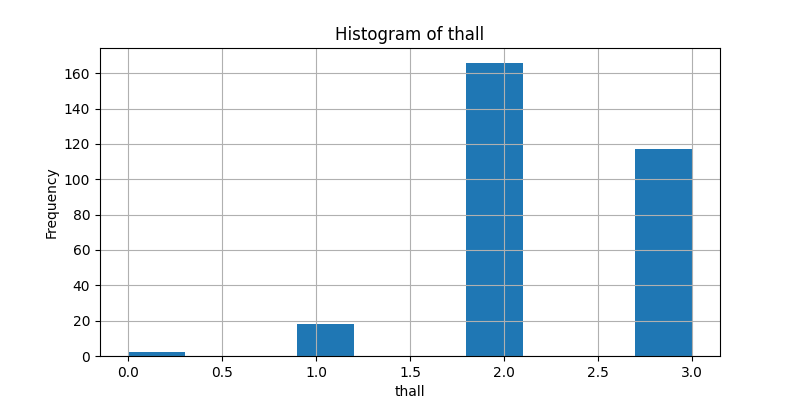

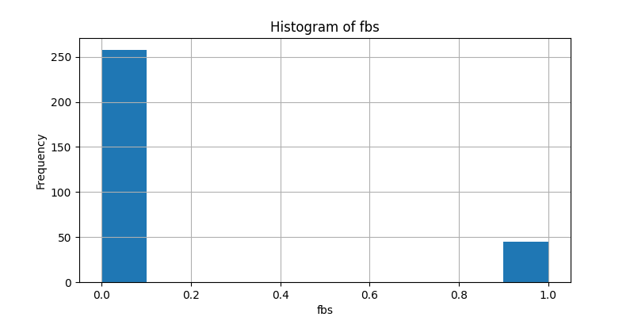

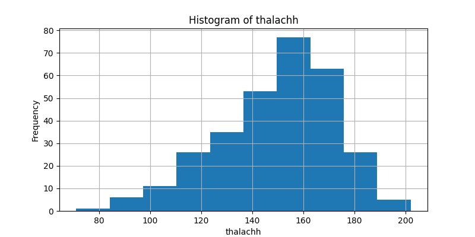

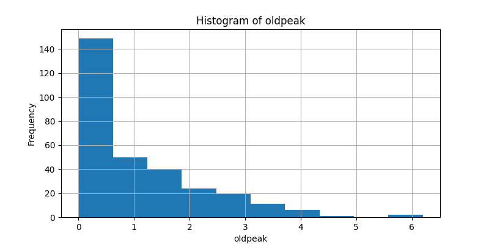

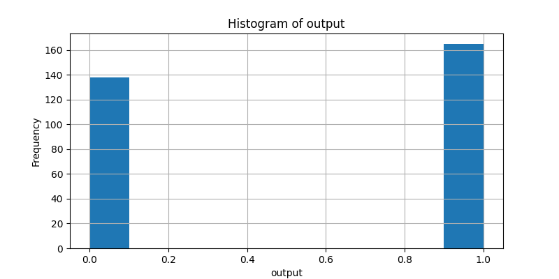

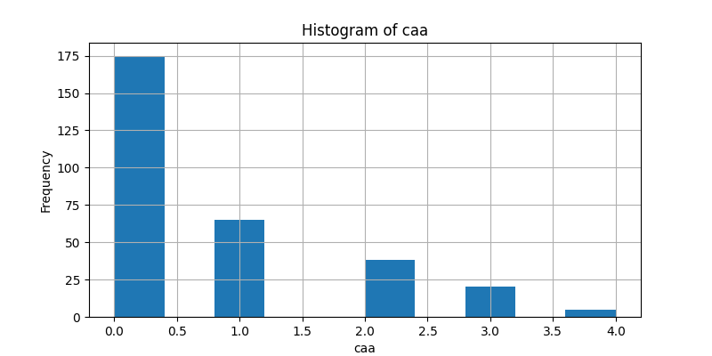

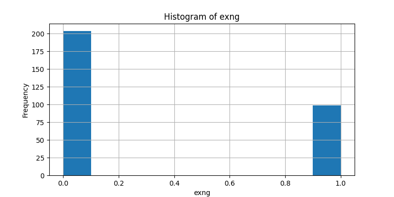

